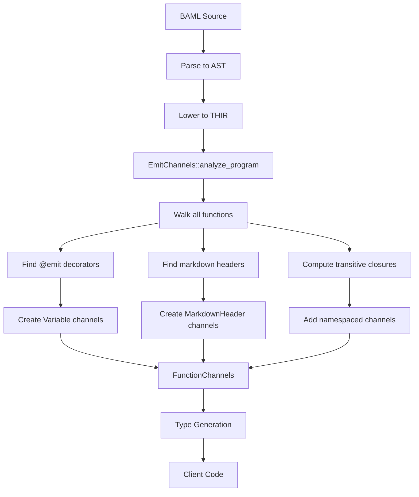
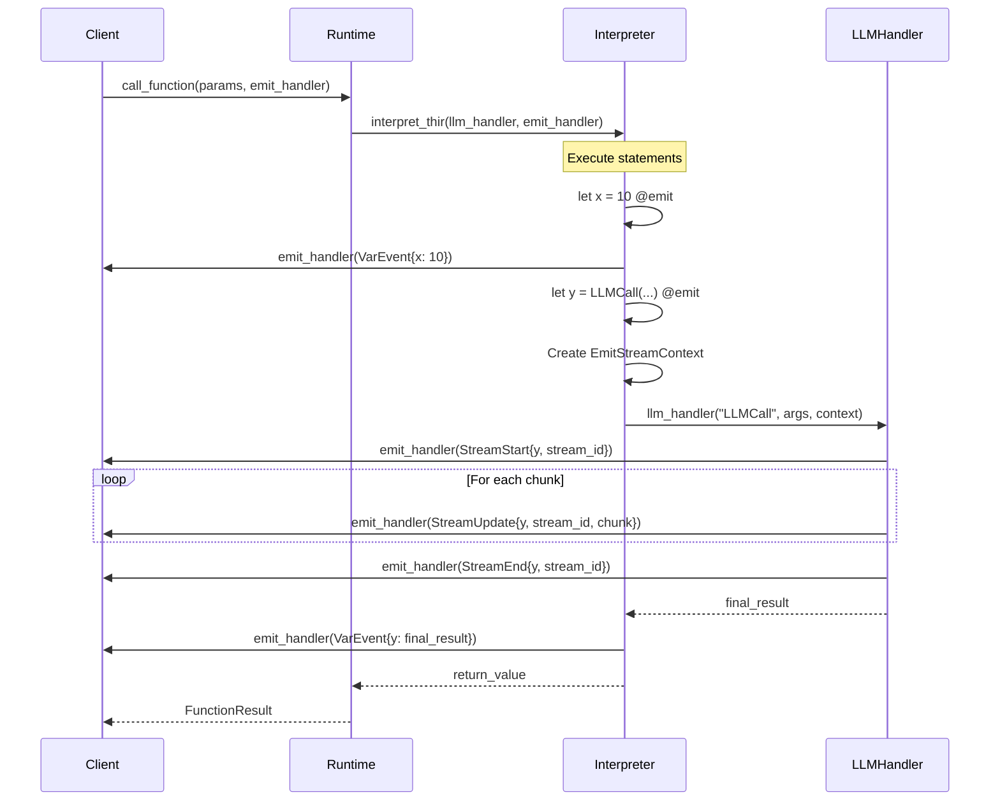

# BAML Emit System

The emit system allows BAML functions to publish real-time events during execution, enabling clients to observe intermediate values, streaming LLM responses, and control flow progress.

## Overview

The emit system has three main components:

1. **Channel Analysis** (`emit.rs`) - Compile-time analysis to determine what channels a function provides
2. **Event Types** (`emit_event.rs`) - Runtime event structures for different kinds of emissions
3. **Event Generation** (in `thir/interpret.rs`) - Runtime event firing during function execution

## Core Concepts

### Channels

A **channel** is a named stream of events that clients can subscribe to. Channels are:
- **Typed**: Each channel has a type (e.g., `int`, `string`, `MyClass`)
- **Named**: Channels are identified by their variable name or explicit `name` parameter
- **Scoped**: Channels can be namespaced by subfunction names

### Emit Decorator

Variables are marked for emission using the `@emit` decorator:

```baml
function MyFunction() -> int {
  let x: int = 10 @emit;                    // Simple emission
  let y: string = "hello" @emit(name=msg);  // Custom channel name
  let z = LLMCall("...") @emit;             // Streaming emission
  x
}
```

### Channel Types

There are two types of channels:

1. **Variable Channels** - Created by `@emit` decorators on variables
2. **Markdown Header Channels** - Created by markdown headers in prompt templates (future feature)

### Fully Qualified Channel Names (FQN)

Each channel is identified by:
- `name`: The terminal name (variable name or custom name)
- `type`: `Variable` or `MarkdownHeader`
- `namespace`: Optional subfunction name (for transitive emissions)

Example FQNs:
- `{ name: "x", type: Variable, namespace: None }` - Direct emission
- `{ name: "x", type: Variable, namespace: Some("ChildFn") }` - Emission from subfunction

## Architecture

### Compile-Time: Channel Analysis



**Key Steps:**

1. **Metadata Collection** - For each function, collect:
   - Direct `@emit` variables with their types
   - Direct subfunction calls
   - Markdown headers in prompts

2. **Transitive Closure** - Compute which functions transitively call which other functions

3. **Channel Synthesis** - For each function, create channels for:
   - Its own emit variables (no namespace)
   - Its own markdown headers (no namespace)
   - Transitive subfunction emit variables (with namespace)
   - Transitive subfunction markdown headers (with namespace)

4. **Type Unification** - If a variable is reassigned multiple times with different types, the channel type becomes a union:
   ```baml
   let x: int = 1 @emit(name=value);
   x = "hello";  // Channel "value" becomes int | string
   ```

### Runtime: Event Generation



### Event Types

#### 1. Variable Events (Non-Streaming)

For simple variable assignments:

```rust
EmitEvent {
    value: EmitBamlValue::Value(baml_value_with_meta),
    variable_name: Some("x"),
    function_name: "MyFunction",
    is_stream: false,
}
```

Fired when:
- A variable marked `@emit` is assigned
- The variable is reassigned

#### 2. Stream Events

For LLM function calls and other streaming sources:

**StreamStart** - Fired before streaming begins:
```rust
EmitEvent {
    value: EmitBamlValue::StreamStart(stream_id),
    variable_name: Some("story"),
    function_name: "MyFunction",
    is_stream: true,
}
```

**StreamUpdate** - Fired for each chunk:
```rust
EmitEvent {
    value: EmitBamlValue::StreamUpdate(stream_id, chunk_value),
    variable_name: Some("story"),
    function_name: "MyFunction",
    is_stream: true,
}
```

**StreamEnd** - Fired after streaming completes:
```rust
EmitEvent {
    value: EmitBamlValue::StreamEnd(stream_id),
    variable_name: Some("story"),
    function_name: "MyFunction",
    is_stream: true,
}
```

The `stream_id` is a correlation ID (format: `{function}_{variable}_{timestamp}`) that allows clients to match the three lifecycle events.

#### 3. Block Events

For markdown header tracking (future feature):

```rust
EmitEvent {
    value: EmitBamlValue::Block(header_label),
    variable_name: None,
    function_name: "MyFunction",
    is_stream: false,
}
```

## Event Metadata

Each emitted value includes rich metadata:

```rust
pub struct EmitValueMetadata {
    pub constraints: Vec<Constraint>,      // Validation constraints
    pub response_checks: Vec<ResponseCheck>, // LLM parsing checks
    pub completion: Completion,            // Streaming completion state
    pub r#type: TypeIR,                    // Runtime type information
}
```

This allows clients to:
- Validate streaming values against constraints
- Track parsing errors and warnings
- Distinguish between partial and final values

## Client-Side Integration

### TypeScript Example

```typescript
const listener = events.MyFunction();

// Subscribe to a variable channel
listener.on_var("x", (event) => {
  console.log(event.value); // Typed as number
});

// Subscribe to a streaming channel
listener.on_stream("story", async (event) => {
  // event.value is BamlStream<string, string>
  for await (const chunk of event.value) {
    console.log("Chunk:", chunk);
  }
});

// Execute with listener
const result = await b.MyFunction({ events: listener });
```

### Stream Correlation

The TypeScript client maintains a registry to correlate stream events:

```typescript
const activeStreams = new Map<StreamId, {
  stream: EmitStream,
  handlers: StreamHandler[]
}>();

// On StreamStart: Create stream and fire handler
const stream = new EmitStream();
activeStreams.set(event.streamId, {stream, handlers});
fireHandlers(VarEvent{value: stream});

// On StreamUpdate: Push to existing stream
activeStreams.get(event.streamId).stream.pushValue(chunk);

// On StreamEnd: Complete and cleanup
activeStreams.get(event.streamId).stream.complete();
activeStreams.delete(event.streamId);
```

## Implementation Details

### Streaming Context Threading

For LLM streaming to work, the interpreter must pass variable name context to the runtime:

1. **Interpreter** detects `let story = LLMCall(...) @emit`
2. **Interpreter** creates `EmitStreamContext { variable_name: "story", stream_id: "..." }`
3. **Interpreter** passes context through expression evaluation
4. **Runtime's llm_handler** receives context and fires stream events with correct variable name

This architectural decision allows the runtime to emit properly-named stream events even though it doesn't naturally know about BAML variable names.

### Type Safety

The channel analysis ensures:
- Client-side event handlers are correctly typed
- Type unions are created for multi-assignment channels
- Transitive channels maintain type information

### Performance Considerations

- Events are fired synchronously during execution
- The emit handler is called from the interpreter thread
- Clients should avoid blocking operations in event handlers
- Stream correlation uses O(1) HashMap lookups

## EmitSpec Options

The `@emit` decorator supports several options:

```baml
let x = 10 @emit(
  name="custom_name",    // Custom channel name (default: variable name)
  when=SomeFunction      // Conditional emission (future feature)
);
```

### EmitWhen

Controls when auto-emission occurs:
- `EmitWhen::True` (default) - Always emit
- `EmitWhen::False` - Manual emission only
- `EmitWhen::FunctionName(fn)` - Conditional based on function result

## Future Enhancements

1. **Markdown Header Events** - Emit events when entering/exiting prompt template sections
2. **Conditional Emission** - `when` parameter to conditionally emit based on runtime values
3. **Block Scoping** - Emit events for control flow blocks (if/else, loops)
4. **Error Events** - Special events for exceptions and validation failures

## Testing

See `baml-compiler/tests/validation_files/functions_v2/tests/` for examples:
- `field_level_assertions_v2.baml` - Constraint checking with emit
- `valid_tests.baml` - Basic emit functionality
- `failing_tests.baml` - Error handling

Integration tests in `integ-tests/typescript/tests/emit.test.ts` demonstrate end-to-end usage.

## Related Files

- `baml-compiler/src/emit.rs` - Channel analysis
- `baml-compiler/src/emit/emit_event.rs` - Event structures
- `baml-compiler/src/emit/emit_options.rs` - Decorator parsing
- `baml-compiler/src/thir/interpret.rs` - Event firing (search for `emit_handler`)
- `baml-runtime/src/async_interpreter_runtime.rs` - Runtime integration
- Generated client code in `*/baml_client/events.ts` - TypeScript integration
